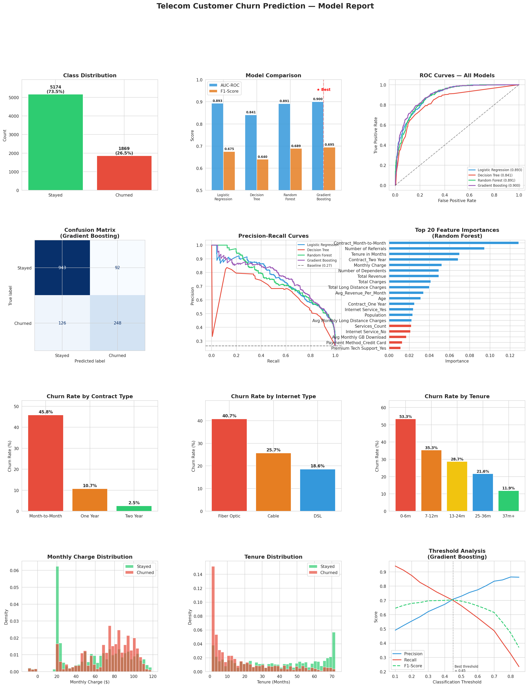

# 📱 Telecom Customer Churn Prediction

A Machine Learning project that predicts which telecom customers are likely to cancel their subscription, using real customer data with 7,043 records.

---

## 📊 Project Overview

Customer churn is one of the biggest challenges in the telecom industry. This project builds and compares multiple ML models to predict churn, helping businesses take action **before** a customer leaves.

---

## 🎯 Results

| Model | AUC-ROC | F1-Score | Accuracy |
|---|---|---|---|
| **Gradient Boosting ★** | **0.900** | **0.695** | **84.5%** |
| Logistic Regression | 0.893 | 0.675 | 78.2% |
| Random Forest | 0.891 | 0.689 | 81.4% |
| Decision Tree | 0.841 | 0.640 | 76.4% |

✅ **Best Model: Gradient Boosting with 90% AUC-ROC Score**

---

## 🔍 Key Findings

- **Month-to-Month contracts** are the biggest predictor of churn (~45% churn rate)
- **Fiber Optic** customers churn at a much higher rate than Cable/DSL customers
- **New customers (0-6 months)** are at the highest risk of churning
- Customers with **more referrals** are significantly more loyal
- Higher **monthly charges** increase the likelihood of churn

---

## 📁 Project Structure

```
telecom-churn-prediction/
│
├── churn_model.py                    ← Full ML pipeline script
├── best_churn_model.pkl              ← Saved best model (ready for inference)
├── churn_model_report.png            ← Visual report with all charts
├── telecom_customer_churn.csv        ← Main dataset (7,043 records)
├── telecom_zipcode_population.csv    ← Zipcode population data
└── telecom_data_dictionary.csv       ← Feature descriptions
```

---

## ⚙️ How It Works

### 1. Data Preprocessing
- Merged zipcode population data with main dataset
- Handled missing values using median/mode imputation
- Encoded categorical variables with One-Hot Encoding
- Scaled numerical features with StandardScaler

### 2. Feature Engineering
- `Avg_Revenue_Per_Month` — Revenue divided by tenure
- `Refund_Rate` — Total refunds as a proportion of revenue
- `Extra_Data_Flag` — Whether customer incurred extra data charges
- `Services_Count` — Total number of services subscribed

### 3. Models Trained
- Logistic Regression
- Decision Tree
- Random Forest
- Gradient Boosting

### 4. Evaluation
- 5-Fold Stratified Cross-Validation
- Metrics: AUC-ROC, F1-Score, Accuracy, Precision, Recall
- Optimal classification threshold analysis

---

## 📈 Visual Report



---

## 🚀 How to Run

### 1. Clone the repository
```bash
git clone https://github.com/chipsbander/telecom-churn-prediction.git
cd telecom-churn-prediction
```

### 2. Install required libraries
```bash
pip install pandas scikit-learn matplotlib seaborn joblib
```

### 3. Run the model
```bash
python churn_model.py
```

### 4. Use the saved model for predictions
```python
import joblib
import pandas as pd

# Load the model
model = joblib.load('best_churn_model.pkl')

# Predict on new data
predictions = model.predict(new_data)
probabilities = model.predict_proba(new_data)[:, 1]
```

---

## 🛠️ Technologies Used


- **Python 3.12**
- **Scikit-learn** — ML models and evaluation
- **Pandas** — Data manipulation
- **Matplotlib & Seaborn** — Visualizations
- **Joblib** — Model saving/loading

---

## 👤 Author

**Adam Musa**
- GitHub: [@chipsbander](https://github.com/chipsbander)

---

## 📄 License

This project is open source and available under the [MIT License](LICENSE).
